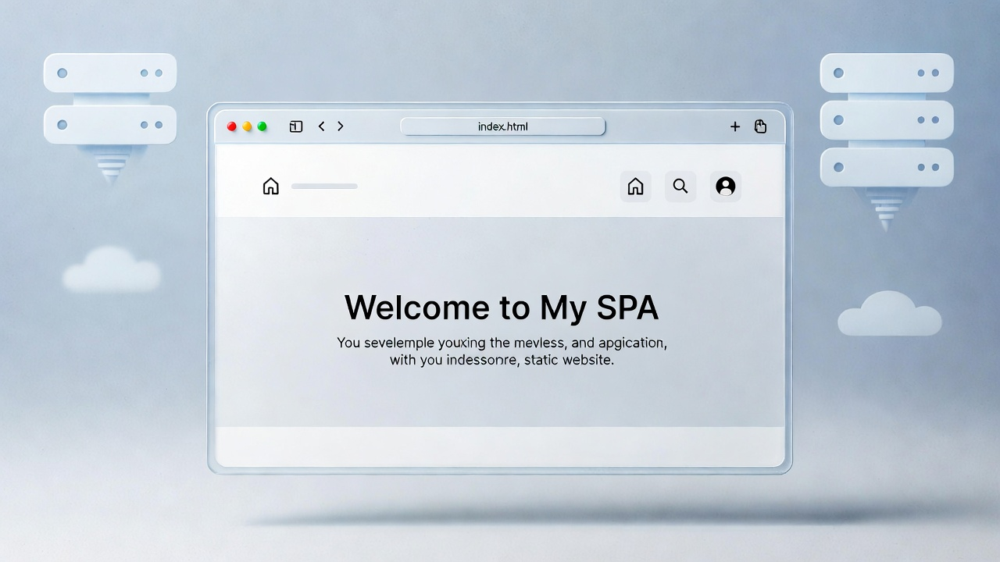

<!--
  STATIC-SPA · Obsidian Forged Systems
  Static Web Systems · Zero-Backend Architecture · Rapid Instantiation Tooling
  Format: OFS-README-TPL v1.0
-->

<div align="center">
  
</div>

<br/>

<p align="center">
  
  
  
  
</p>

---

## Abstract

Small reference sites, dashboards, and field tools routinely get built on framework stacks whose build pipelines, dependency churn, and hosting costs exceed the value of the content they serve. STATIC-SPA is a zero-dependency, hash-routed single-page-application template — a four-file engine (HTML shell, token-themed CSS, data-driven router, custom-view registry) that deploys to GitHub Pages with no build step and no server. All user state persists in namespaced browser localStorage, giving zero data custody, offline-tolerant operation, and content editable from any device including the GitHub mobile web editor. The template has been validated by headless routing/render tests (7/7 pass) and proven by its first instantiation, [`technical-cv`](https://github.com/Crusader0711/technical-cv), stood up in under 30 minutes.

> **Design intent:** A reusable mold for browser-only reference apps — improve the engine once, and every future project inherits it.

---

## Project Dashboard

<div align="center">

| Metric | Target | Current | Δ |
|:-------|:------:|:-------:|:--:|
| **Schedule** — First downstream instantiation | 2026-08-22 | 2026-08-22 (`technical-cv`) | ON_TRACK |
| **Budget / Hosting Cost** | $0 / mo | $0 / mo (GitHub Pages) | ON_TRACK |
| **Instantiation Time** | ≤ 30 min | ~30 min (measured, technical-cv) | ON_TRACK |
| **Runtime Dependencies** | 0 | 0 | ON_TRACK |
| **Source Weight (engine + shell)** | ≤ 30 KB | ~26.6 KB / 8 files | ON_TRACK |
| **Test Coverage / V&V** | 7 smoke checks | 7/7 PASS (jsdom headless) | ON_TRACK |
| **Open Risks (High)** | 0 | 0 | — |

</div>

---

## Scope & Objectives

**In scope**

- Provide a hash-routed SPA engine that generates nav and routes entirely from a declarative `PAGES` array with zero per-project engine edits
- Ship four built-in page types — `linkGrid`, `cards`, `checklist`, `custom` — covering ≥ 90 % of reference-app content patterns without new code
- Isolate all theming to a single CSS TOKENS block (8 colors × light/dark + 3 font stacks) editable in ≤ 10 minutes
- Enable a complete zero-to-live-site path for a first-time user via [`BUILD_TUTORIAL.md`](BUILD_TUTORIAL.md)
- Standardize downstream repo documentation via [`PROJECT_README_TEMPLATE.md`](PROJECT_README_TEMPLATE.md) (OFS-README-TPL)

**Explicitly out of scope**

- Multi-user or cross-device synchronized state (localStorage is single-browser by design)
- Authentication, secrets handling, or private content (GitHub Pages sites are public)
- SEO-optimized long-form content sites (use Jekyll/Astro — see decision matrix in the guide)
- Any build toolchain, package manager, or framework dependency

**Success criteria** — the project is *done* when a new reference site can be instantiated, themed, populated, and live on GitHub Pages in ≤ 30 minutes by following repo documentation alone, with no engine-file edits.

---

## System Architecture

```text
┌─────────────────┐     ┌──────────────────┐     ┌──────────────────┐
│  CONTENT LAYER   │────▶│  ENGINE LAYER    │────▶│  PRESENTATION     │
│  js/data.js      │     │  js/app.js       │     │  index.html + CSS │
│  SITE + PAGES    │     │  hash router +   │     │  token-themed DOM │
│  declarations    │     │  type renderers  │     │  render           │
└─────────────────┘     └──────────────────┘     └──────────────────┘
        │                        │                        │
        ▼                        ▼                        ▼
  js/custom.js             localStorage             GitHub Pages
  (CUSTOM registry)        (namespaced state)       (static hosting)
```

| Layer | Component | Interface / Protocol | Notes |
|:------|:----------|:---------------------|:------|
| Content | `js/data.js` | Global `SITE`, `PAGES` objects | Single source of truth; 95 % of per-project edits |
| Engine | `js/app.js` | `location.hash` → renderer dispatch | Never edited per project; unknown routes fall back to page 1 |
| Extension | `js/custom.js` | `window.CUSTOM[fn](el, ctx)` | `ctx.esc()` is the XSS boundary — all user-visible strings pass through it |
| State | localStorage | `SITE.lsPrefix` namespace | ~5 MB budget; evictable; export/import pattern in guide §6 |
| Hosting | GitHub Pages | HTTPS static file serving | Hash routing avoids 404-rewrite requirement of history-API routing |

---

## Dependencies & Environment

### Runtime / Software

| Dependency | Version | Purpose | Pinned? |
|:-----------|:-------:|:--------|:-------:|
| Browser (evergreen) | ES2017+ | Sole runtime | ✅ |
| Git | 2.x | Version control / deploy trigger | ✅ |
| — | — | **No frameworks, no npm, no build step** | ✅ |

### Hardware / Physical

| Item | Spec | Qty | Source | Notes |
|:-----|:-----|:---:|:-------|:------|
| Any device with a browser | — | 1 | — | Content editable from mobile via GitHub web editor |

### Environmental Requirements

- **Power / Compute:** none server-side; client renders 8 static files
- **Network:** loads on any connection; fully functional offline after first load except external fetches
- **Security posture:** no outbound calls by default; no analytics; no cookies; state local-first in namespaced localStorage
- **Hosting constraint:** public repo + public site — content policy is public-release-only

---

## Milestones & Roadmap

| ID | Milestone | Exit Criteria | Target | Status |
|:--:|:----------|:--------------|:------:|:------:|
| M1 | Template v1.0 engine | 4 page types render; 7/7 headless smoke checks pass | 2026-08-22 | ✅ |
| M2 | Beginner onboarding | BUILD_TUTORIAL.md covers zero-to-live with troubleshooting table | 2026-08-22 | ✅ |
| M3 | First instantiation | `technical-cv` live from template in ≤ 30 min | 2026-08-22 | ✅ |
| M4 | README standardization | OFS-README-TPL adopted; downstream repos conform | 2026-08 | 🟢 |
| M5 | Second instantiation | Next project ships with zero engine edits; back-port any fixes | TBD | 🟡 |

---

## Risk Register

| ID | Risk | L | C | Score | Mitigation | Owner | Status |
|:--:|:-----|:-:|:-:|:-----:|:-----------|:-----:|:------:|
| R1 | If downstream projects edit `app.js` locally, then template and instances drift, resulting in un-back-portable fixes | 3 | 3 | 9 | Engine marked do-not-edit; guide mandates back-port loop to this repo | OFS | Watch |
| R2 | If a `data.js` edit introduces a syntax error, then the site renders blank, resulting in downtime until reverted | 3 | 2 | 6 | Tutorial §8 documents GitHub file-History restore; edits are single-file and atomic | OFS | Open |
| R3 | If browser storage is cleared, then checklist/tool state is lost, resulting in user data loss | 2 | 2 | 4 | Export/import extension pattern documented (guide §6); state is convenience-tier by design | OFS | Watch |
| R4 | If content grows past ~1,500 lines of `data.js`, then maintainability degrades, resulting in pattern misuse | 2 | 2 | 4 | Guide §2 fit criteria + decision matrix route oversized projects to Jekyll/Astro | OFS | Watch |

---

## Verification & Test

| Test | Method | Requirement Traced | Result | Evidence |
|:-----|:-------|:-------------------|:------:|:---------|
| Route rendering (4 pages) | Headless (jsdom) | Engine renders all declared PAGES | PASS | Smoke harness, 2026-08-22 |
| Unknown-route fallback | Headless (jsdom) | `#/garbage` → first page active | PASS | Smoke harness |
| Nav generation from PAGES | Headless (jsdom) | Tab count = PAGES length | PASS | Smoke harness |
| localStorage persistence | Bench / manual | Checklist dates survive refresh | PASS | Manual checklist (guide §8) |
| Responsive @ 380 px | Bench / manual | No horizontal scroll | PASS | Manual checklist |
| Dark-mode contrast | Bench / manual | Tags/status legible both themes | PASS | Manual checklist |

**Repro:** `python3 -m http.server` in repo root → verify against the checklist in `TEMPLATE_GUIDE.md` §8.

---

## Quick Start

```bash
# Instantiate a new project (GitHub UI: "Use this template" — or clone)
git clone https://github.com/Crusader0711/static-spa.git my-project
cd my-project && rm -rf .git && git init

# Edit exactly three files
#   js/data.js      → SITE config + PAGES content
#   css/style.css   → TOKENS block only (theme)
#   js/custom.js    → bespoke pages (optional)

# Preview locally
python3 -m http.server    # → http://localhost:8000

# Ship (then Settings → Pages → main / root)
git add -A && git commit -m "Instantiate from static-spa" && git push
```

First time doing any of this? Start with **[BUILD_TUTORIAL.md](BUILD_TUTORIAL.md)**.
New project READMEs start from **[PROJECT_README_TEMPLATE.md](PROJECT_README_TEMPLATE.md)**.
Architecture, fit criteria, and extension patterns: **[TEMPLATE_GUIDE.md](TEMPLATE_GUIDE.md)**.

---

## Tech Stack

<p align="left">
  
  
  
  
  
</p>

---

## Changelog

| Version | Date | Change |
|:-------:|:----:|:-------|
| v1.1.0 | 2026-08-22 | Added BUILD_TUTORIAL.md and OFS PROJECT_README_TEMPLATE.md; README migrated to OFS-README-TPL v1.0 |
| v1.0.0 | 2026-08-22 | Initial architecture and baseline commit — engine, 4 page types, TEMPLATE_GUIDE.md |

---

## Connect

<p align="center">
  <a href="https://github.com/Crusader0711"></a>
  <a href="https://x.com/Crusader2C7"></a>
  <a href="https://medium.com/@Crusader2c7"></a>
</p>

---

<div align="center">
  <sub>Obsidian Forged Systems · STATIC-SPA · Built for environments that punish fragility</sub>
</div>
